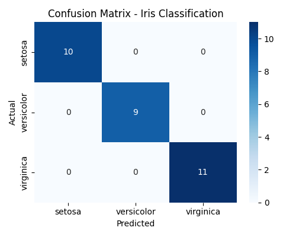

# 🧠 Machine Learning Labs Series

Welcome to the **Machine Learning Labs Series** — a comprehensive, hands-on learning journey covering the **foundations, mathematics, data preprocessing, model building, and deep learning** essentials of modern AI.

This repository contains **50 structured labs**, each building upon the previous one to guide learners from **Python fundamentals** all the way to **end-to-end machine learning workflows**.

---

## 📂 Repository Structure

Each lab follows a consistent and GitHub-ready format:

```
labXX-topic/
├── labXX_<topic>.py              # Main lab script
├── README.md                     # Lab overview and objectives
├── commands.sh                   # CLI commands used in the lab
├── troubleshooting.md             # Common issues and fixes
├── interview_qna.md               # 10 real-world interview Q&As
└── screenshots/                  # Actual output visuals
```

Each folder is self-contained and can be executed independently.

---

## 🧩 Lab Index (1–50)

| # | Lab Title | Focus Area |
|:-:|------------|------------|
| 01 | Intro to Python for ML | Setup & Basics |
| 02 | Setting Up Python ML Environment | Environment Setup |
| 03 | Variables & Data Types | Python Basics |
| 04 | Control Structures | Conditional Logic |
| 05 | Functions in Python | Code Reusability |
| 06 | Loops & Iterations | Program Flow |
| 07 | Lists & Tuples | Data Structures |
| 08 | Dictionaries & Sets | Collections |
| 09 | File I/O in Python | Data Handling |
| 10 | NumPy Arrays | Numerical Computation |
| 11 | NumPy Operations | Array Manipulation |
| 12 | Pandas DataFrames | Data Analysis |
| 13 | Load CSV Files | Data Loading |
| 14 | Data Cleaning | Data Quality |
| 15 | Exploratory Data Analysis | EDA |
| 16 | Matplotlib Basic Plots | Data Visualization |
| 17 | Histograms & Scatter Plots | Visualization |
| 18 | Seaborn for ML Visualization | Advanced Plotting |
| 19 | Feature Scaling | Preprocessing |
| 20 | Categorical Encoding | Feature Engineering |
| 21 | Simple Linear Regression | Regression |
| 22 | Evaluating Regression Models | Metrics |
| 23 | Logistic Regression | Classification |
| 24 | Confusion Matrix | Model Evaluation |
| 25 | k-NN Classification | Distance-Based Models |
| 26 | Decision Trees | Tree-Based Models |
| 27 | Visualizing Decision Trees | Interpretability |
| 28 | Splitting Data | Data Management |
| 29 | Cross-Validation | Model Robustness |
| 30 | Model Persistence | Saving Models |
| 31 | Data Augmentation | Synthetic Data |
| 32 | Regex Data Cleaning | NLP Preprocessing |
| 33 | Feature Engineering | Transformation |
| 34 | Working with DateTime | Temporal Data |
| 35 | Web Scraping | Data Collection |
| 36 | Data Pipelines | Automation |
| 37 | Custom Transformers | scikit-learn API |
| 38 | Bagging Ensemble | Model Ensemble |
| 39 | Boosting Ensemble | Model Optimization |
| 40 | Random Forest | Ensemble Learning |
| 41 | GridSearchCV | Hyperparameter Tuning |
| 42 | Support Vector Machines | Margin-Based Models |
| 43 | Neural Networks with Keras | Deep Learning |
| 44 | Visualizing Training History | Performance Analysis |
| 45 | Convolutional Neural Networks | Image Processing |
| 46 | LSTM Networks | Sequence Modeling |
| 47 | NLP Basics with NLTK | Natural Language Processing |
| 48 | Text Vectorization | CountVectorizer & TF-IDF |
| 49 | Sentiment Analysis | Text Classification |
| 50 | End-to-End ML Workflow | Final Project |

---

## 🛠️ Tech Stack

| Category | Tools |
|-----------|--------|
| **Programming** | Python 3.x |
| **Data Handling** | NumPy, Pandas |
| **Visualization** | Matplotlib, Seaborn |
| **Machine Learning** | scikit-learn |
| **Deep Learning** | TensorFlow / Keras |
| **NLP** | NLTK, TF-IDF, Logistic Regression |
| **Version Control** | Git, GitHub |
| **Environment** | VS Code, Jupyter Notebook, Ubuntu EC2 |

---

## 🚀 Features

- 💡 Step-by-step learning path from beginner to advanced  
- 🧩 Modular structure — each lab is self-contained  
- 🧠 Real-world **interview Q&A** included in every lab  
- 🖼️ Screenshots and code outputs for quick visual verification  
- ⚙️ Ready-to-deploy **Git automation scripts** (`step3_git_push_labXX.sh`)  
- 🧾 Fully reproducible labs for self-study or academic use  

---

## 📊 Example Output (Lab 50)


> The final project demonstrates an **end-to-end ML workflow**:  
> Data preprocessing → Feature scaling → Model training → Evaluation using confusion matrix and accuracy metrics.

---

## 📘 How to Run

```bash
# Clone this repository
git clone https://github.com/le3arn2code/machine-learning.git
cd machine-learning

# Navigate to any lab folder
cd lab25-knn-classification

# Run the main Python file
python3 lab25_knn_classification.py
```

> All dependencies (NumPy, Pandas, scikit-learn, Matplotlib, Seaborn, NLTK, TensorFlow) should be installed in your environment.

---

## 🧠 Learning Outcomes

By completing all 50 labs, you will:
- Build a strong foundation in Python and data manipulation  
- Understand ML algorithms, evaluation metrics, and deployment basics  
- Implement supervised and unsupervised models  
- Gain exposure to deep learning, NLP, and ensemble methods  
- Be ready for ML/DL engineering interviews and projects  

---

## 👨‍💻 Author

**Haroon ur Rasheed ([@le3arn2code](https://github.com/le3arn2code))**  
📍 DevOps & Machine Learning Enthusiast  
🔗 Building open-source AI and automation learning paths  

---

## 🏁 License

This repository is distributed under the **MIT License**.  
Feel free to use it for learning, teaching, or professional portfolio purposes.

---

⭐ **If this helped you learn Machine Learning, please star the repository!**
