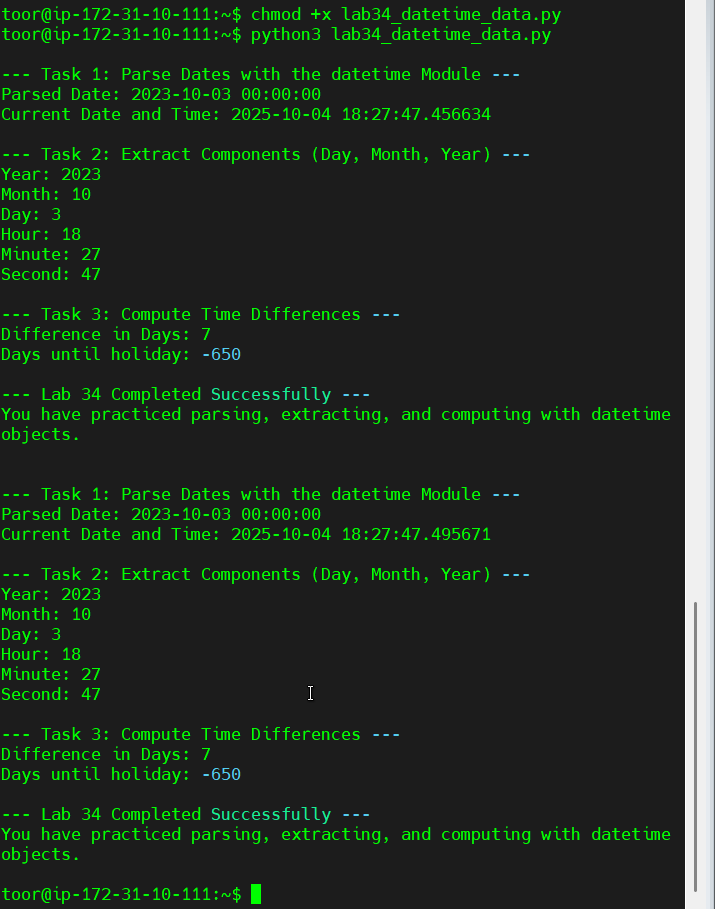

# Lab 34: Working with DateTime Data in Python

## Objectives
- Parse and manipulate date/time data using the `datetime` module.
- Extract components (day, month, year, hour, minute, second).
- Compute time differences and event countdowns.

## Output Summary
The program demonstrates:
1. Parsing date strings.
2. Extracting date/time components.
3. Calculating differences between dates.
4. Counting down to a future event (holiday).

## Screenshot

## Expected Output
Parsed Date: 2023-10-03 00:00:00  
Current Date and Time: 2025-10-04 18:27:47  
Year: 2023  
Month: 10  
Day: 3  
Difference in Days: 7  
Days until holiday: -650
